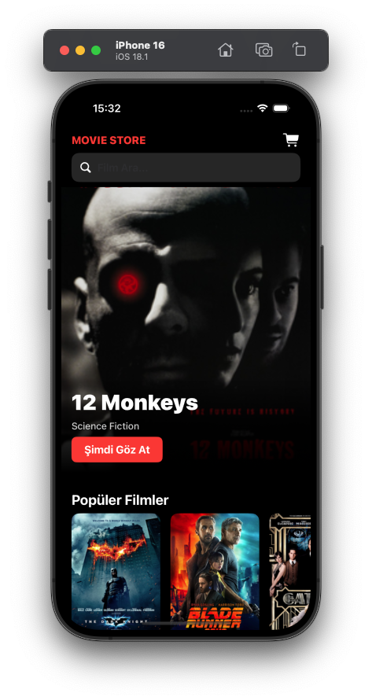
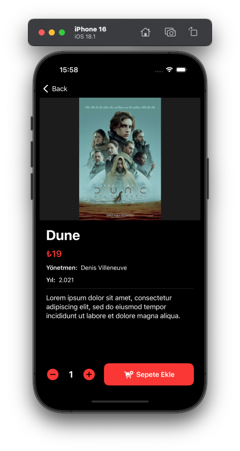
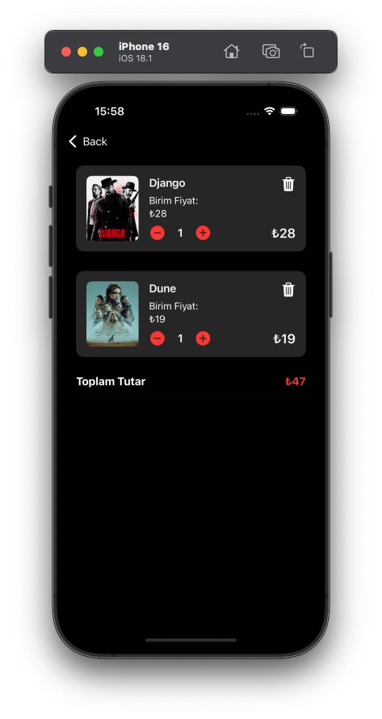

# 🎬 MOVIE STORE (SwiftUI)

This project is a movie sales application developed using SwiftUI. Users can browse movies, view their details, and purchase them directly through the app.

## Technologies Used

* SwiftUI

* MVVM Design Pattern

  
## Features

* View movie list
* Movie detail page
* Purchase functionality
* Modern user interface built with SwiftUI
* MVVM design pattern

## Screenshots

  
  
  

